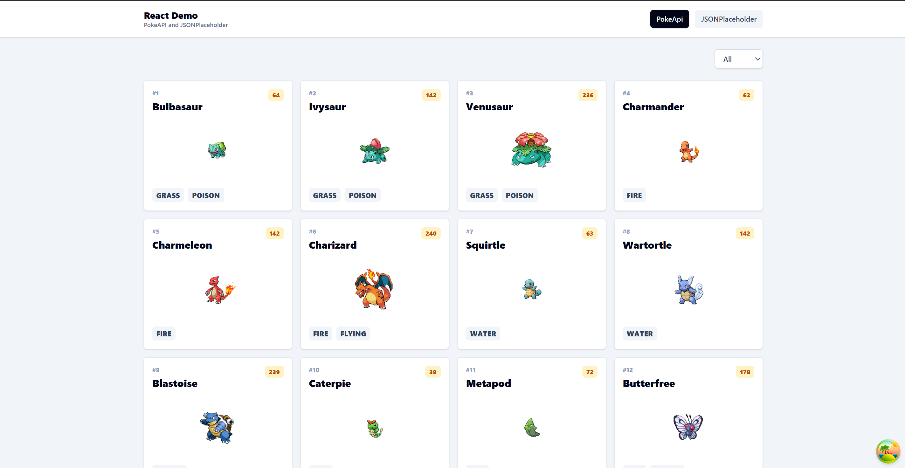

## Installation

1. Clone the repository:

    ```bash
    git clone https://github.com/amorindev/poke-app.git
    ```

2. Download dependencies:

    ```bash
    npm i
    ```

3. Set environment variables, add a `.env` file based on `.env.example`:

    ```bash
    VITE_POKEAPI_BASE_URL=https://pokeapi.co/api/v2
    ```

4. Run the project:

    ```bash
    npm run dev
    ```